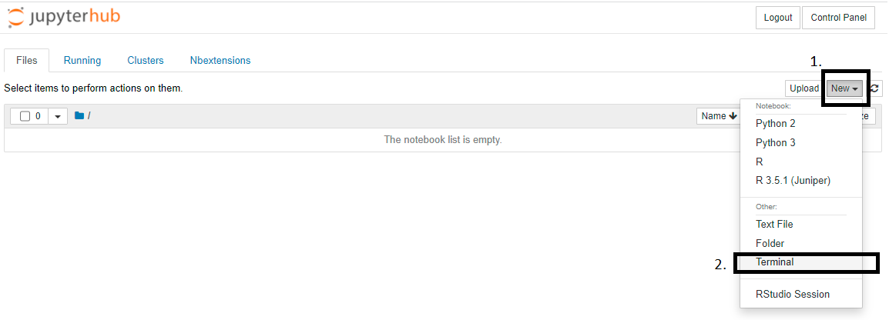

# Forward Protons short exercise for the 2022 CMSDAS@LPC

General information on CMSDAS 2022:
* [CMSDAS2022 main page](https://indico.cern.ch/event/1088671/)
* [All short exercises](https://twiki.cern.ch/twiki/bin/view/CMS/CMSDASAtLPC2022#ShortExercises2022LPC)
* [Exercise Twiki](https://twiki.cern.ch/twiki/bin/view/CMS/SWGuideCMSDataAnalysisSchoolLPC2022TaggedProtonsShortExercise)

**Video introduction** (from CMSDAS2020): [watch here!](https://videos.cern.ch/record/2730189)

## Recommended way to run the exercise

### Getting Started (login)
This tutorial uses Jupyter Notebooks as a browser-based development environment at Vanderbilt. These Jupyter-based tutorials use a pre-configured Jupyter service usable by all CMS members.

To log in, access the [login](https://jupyter.accre.vanderbilt.edu/) page and login using your CERN credentials. 

Once you successfully connect,  click the `New` box at the top right, then the `Terminal` option as shown bellow:


#### Upload grid certificates

We will copy your grid certificates from the LPC cluster, to do this, execute the follosing commends in the terminal to copy your certificate from the LPC to Jupyter (note: replace `username` with your `FNAL` username!)
```bash
kinit username@FNAL.GOV
rsync -rLv username@cmslpc-sl7.fnal.gov:.globus/ ~/.globus/
chmod 755 ~/.globus
chmod 600 ~/.globus/*
kdestroy
```

If you have a password on your grid certificate, you'll need to remember to execute the following in a terminal ***each time you log in to Jupyter***.
```bash
voms-proxy-init -voms cms -valid 192:00
```

#### Checkout the code

In the terminal, run
```bash
wget https://raw.githubusercontent.com/CMSDAS/pps-short-exercise/DAS2022/setup.ipynb
```

Go back to your Jupyter browser (Home) page and open/run(double-click) the newly downloaded notebook (setup.ipynb - downloaded just recently - only one cell to run). 
This will checkout the code and setup your environment for future use. After running setup.ipynb, choose "File... Close and Halt". 

***Remember*** each time you open the notebook, you should change the Kernel to `das-pps`.

## Table of content

The exercise is organised in three Jupyter notebooks:

### 1. [Optical functions](https://nbviewer.jupyter.org/github/cmsdas/pps-short-exercise/blob/master/Optical-Functions.ipynb)  

In the first exercise, we will discuss proton transport and how protons propagate along the beamline under LHC magnetic field influence. Beam protons, taking place in diffractive interactions, can be scattered at small angles &theta; (usually measured in &mu;rad) and lose their momentum (typically denoted by &xi;). 

You can consult also with this [video](https://videos.cern.ch/record/2729663) recorded for DAS2020.
 
### 2. [Tracker Efficiencies](https://nbviewer.jupyter.org/github/cmsdas/pps-short-exercise/blob/master/PixelEfficiencies.ipynb)  


Tracker efficiencies are crucial to make proton data usable. Protons are available in two reconstruction flavors: singleRP and multiRP. We will now focus on the second category and see how we can extract the adequate efficiency corrections ([video@CMSDAS2020](https://videos.cern.ch/record/2728988)).

Please open the notebook called 'PixelEfficiencies' and follow [this video](https://videos.cern.ch/record/2729281).


### 3. [PPS protons in dilepton events](https://nbviewer.jupyter.org/github/cmsdas/pps-short-exercise/blob/master/Dilepton-Protons.ipynb)  

In the third exercise, we will implement what we learned from the first two exercises on the real data. The dataset we will use was recorded during the 2017 data taking period. 

We will look on central exclusive production of pair of muons. This measurement was the first obtained with PPS detectors (summarized in [JHEP 07 (2018) 153](https://link.springer.com/article/10.1007/JHEP07(2018)153))

